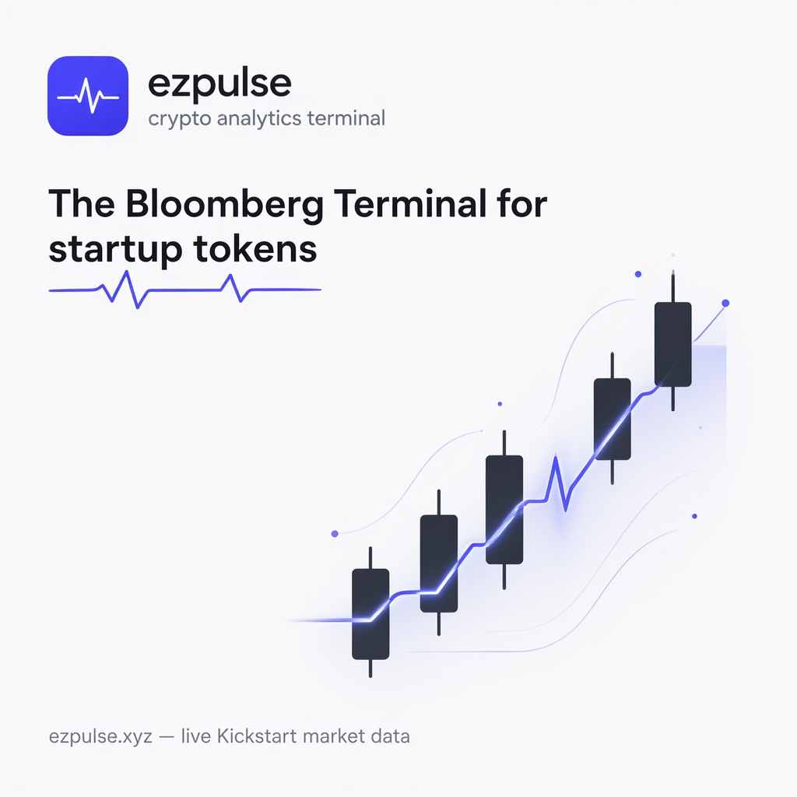

<div align="center">



# ezpulse

**The Bloomberg Terminal for startup tokens.**

Live market, real-time signals, and a research page per project — for the EasyA Kickstart ecosystem.

[**ezpulse.xyz**](https://ezpulse.xyz) · [X @ezpulsexyz](https://x.com/ezpulsexyz)

`Momentum is measurable.`

</div>

---

## What it does

| | |
|---|---|
| ◉ **Market** | Every Kickstart token, auto-discovered by its on-chain fingerprint (contracts ending in `EASY`), ranked by market cap with real bonding-curve state |
| 📟 **Projects** | A Bloomberg-style page per token: live chart, AI insights, your position, website & socials |
| ⚡ **Signals** | Real-time ecosystem feed — whale moves, momentum, volume spikes, rank battles |
| ★ **Watchlist** | Star tokens, get 🔔 in-app alerts when their signals fire |
| 💼 **Portfolio** | Watch-only: paste any address or sign in with Phantom (read-only, no signatures) |
| 🧺 **Indexes** | Cap-weighted live baskets: Composite, Verified, Momentum 5, Liquid |

**100% live data.** Jupiter (`launchpad: easya-kickstart` — canonical provenance + bonding-curve state) → DexScreener (prices, txns) → Meteora DBC (curve enrichment) → Solana RPC (balances). Nothing simulated.

## Trust model

- Only contracts with the Kickstart fingerprint are listed — `…EASY` suffix or a kickstart.easya.io page on-chain
- ✓ **Verified** = the project's X account is authorized (address-in-bio). Confirms the link only, never an endorsement
- 🔗 **Bonded** = bonding curve completed (graduated) · ⏳ **Bonding** = live curve % from chain state
- Wallet connections are read-only. No signatures, no custody, no cookies

## Develop

```bash
npm install
npm run dev     # localhost:5173
npm run build   # single-file dist/index.html
```

**Stack:** React + TypeScript + Vite + Tailwind. Deploys to GitHub Pages via `.github/workflows/deploy.yml`. Optional Supabase backend (watchlist sync, feature votes) via `VITE_SUPABASE_URL` / `VITE_SUPABASE_ANON_KEY` secrets — see `supabase/ezpulse-schema.sql`. For local development, copy `.env.example` to `.env.local` and fill in your values. For GitHub Pages, set the same names as repository secrets in the Actions settings. Without them, the app runs fully local.

## Disclaimer

ezpulse is an independent analytics platform, not affiliated with EasyA. Nothing here is investment advice. Idea-coins are highly speculative — always verify the `…EASY` contract suffix and DYOR.

---

<sub>© 2026 ezpulse · ezpulse.xyz</sub>
